- **Pratikum 1 :** Membuat Project Flutter Baru

**langkah 1**
Membuat project flutter,tekan tombol Ctrl + Shift + P maka akan tampil Command Palette, lalu ketik Flutter. Pilih New Application Project

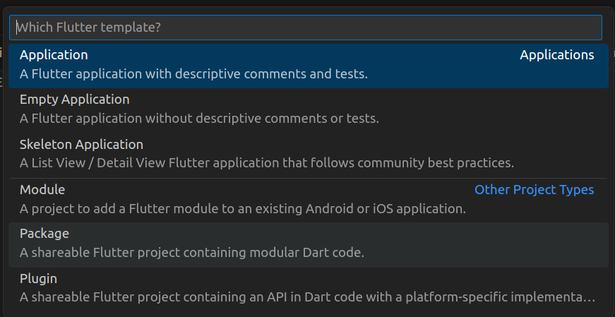 


**langkah 2**
Kemudian pilih folder

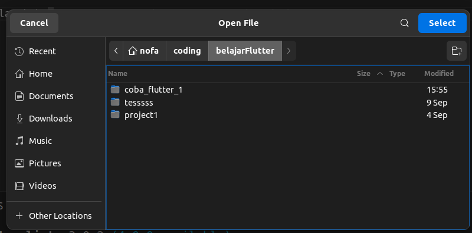

**langkah 3**
Beri nama project flutter

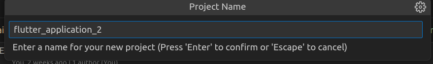

**Langkah 4**

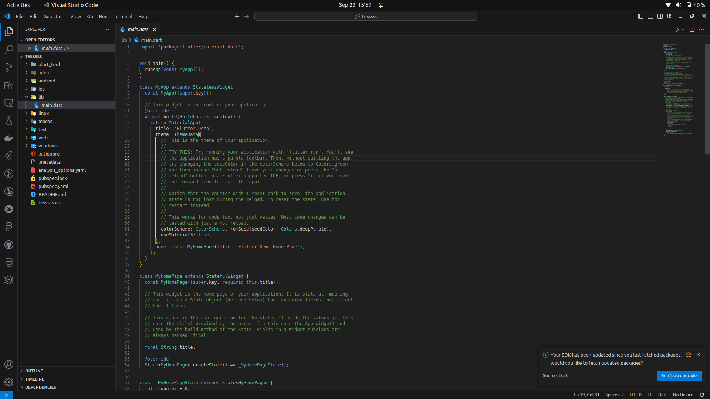


- **Pratikum 2 :** Membuat Repository GitHub dan Laporan Praktikum

**Langkah 1**
Login ke akun GitHub, lalu buat repository baru

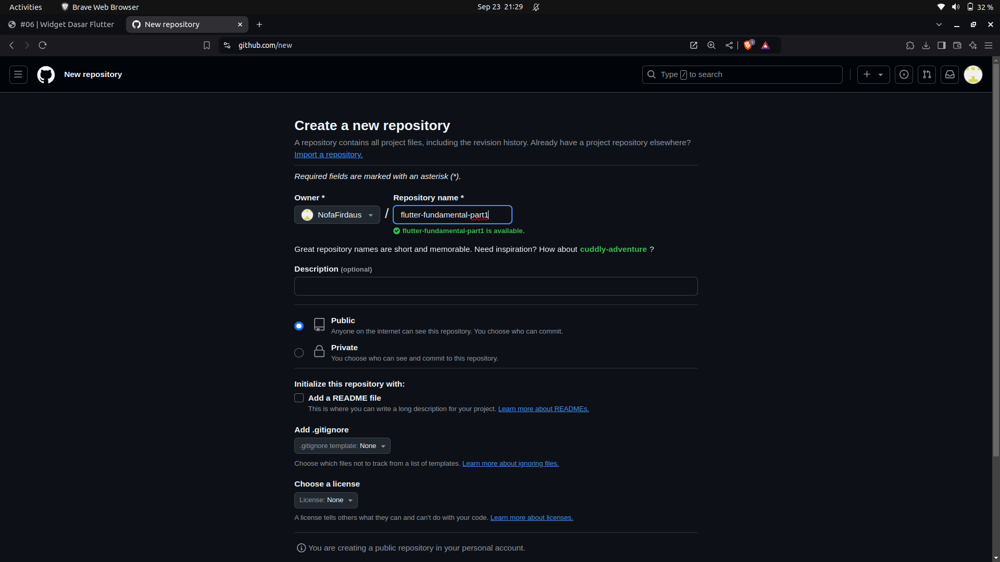

**Langkah 2**
Lalu klik tombol "Create repository" 

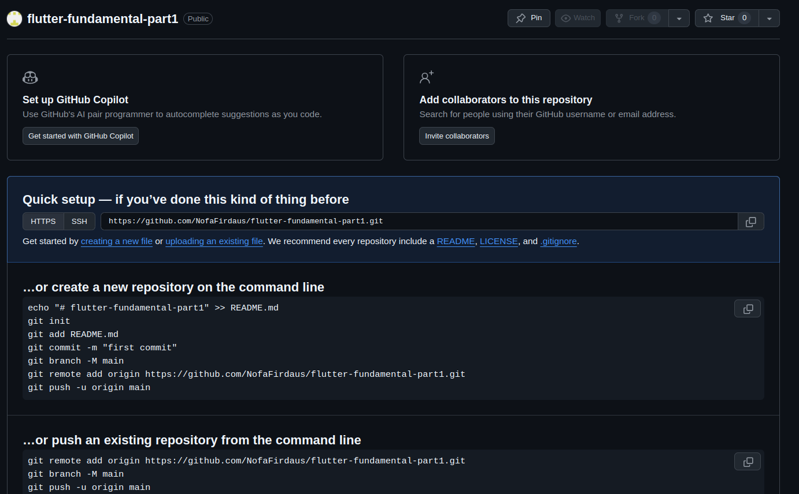

**Langkah 3**
Kembali ke VS code,buka terminal pada menu Terminal > New Terminal. Lalu ketik perintah berikut untuk inisialisasi git pada project

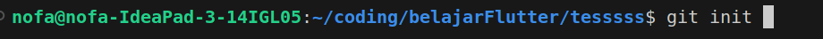

**Langkah 4**
Pilih menu Source Control di bagian kiri, lalu lakukan stages (+) pada file .gitignore untuk mengunggah file pertama ke repository GitHub.

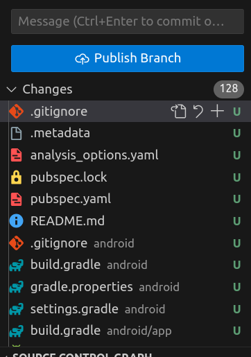

**Langkah 5**
Beri pesan commit "tambah gitignore" lalu klik Commit (✔)

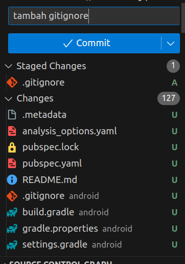

**Langkah 6**
Lakukan push dengan klik bagian menu titik tiga > Push

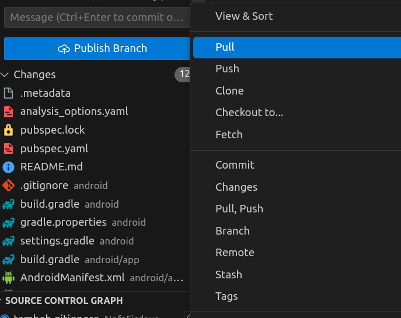

**Langkah 7**
Di pojok kanan bawah akan tampil seperti gambar berikut. Klik "Add Remote"

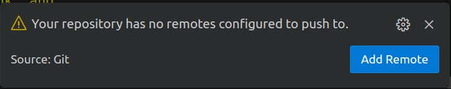

**Langkah 8**
Salin tautan repository Anda dari browser ke bagian ini, lalu klik Add remote!

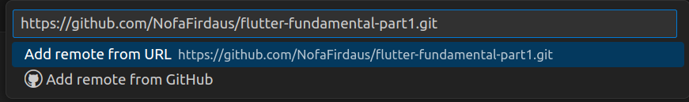

Setelah berhasil, tulis remote name dengan "origin"

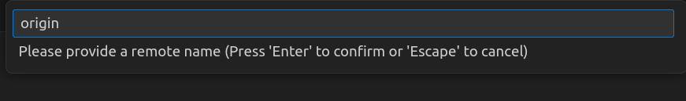

**Langkah 9**
Lakukan hal yang sama pada file README.md mulai dari Langkah 4. Setelah berhasil melakukan push, masukkan username GitHub Anda dan password berupa token yang telah dibuat (pengganti password konvensional ketika Anda login di browser GitHub). Reload halaman repository GitHub Anda, maka akan tampil hasil push kedua file tersebut seperti gambar berikut.

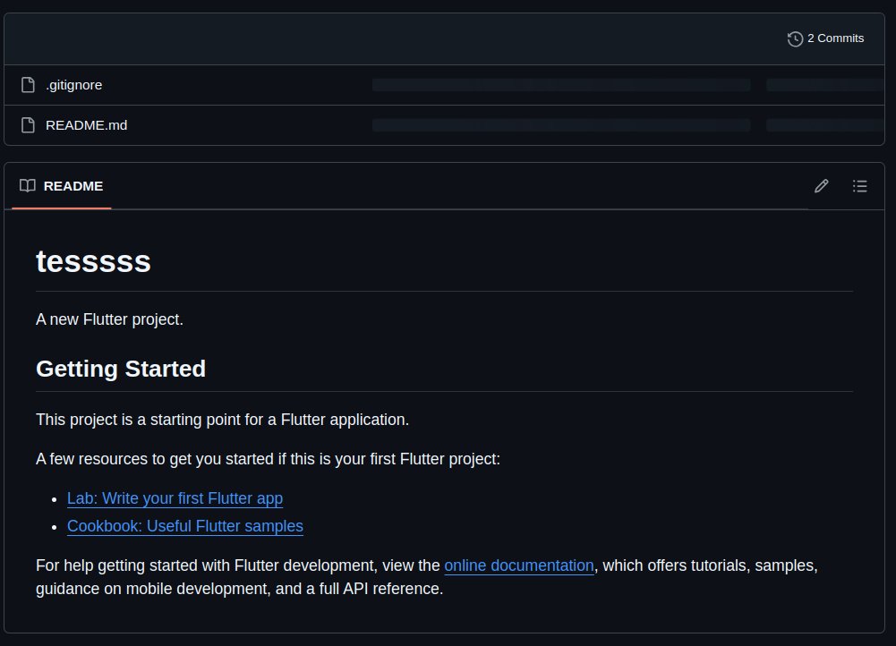

**Langkah 10** 
Lakukan push juga untuk semua file lainnya dengan pilih Stage All Changes.

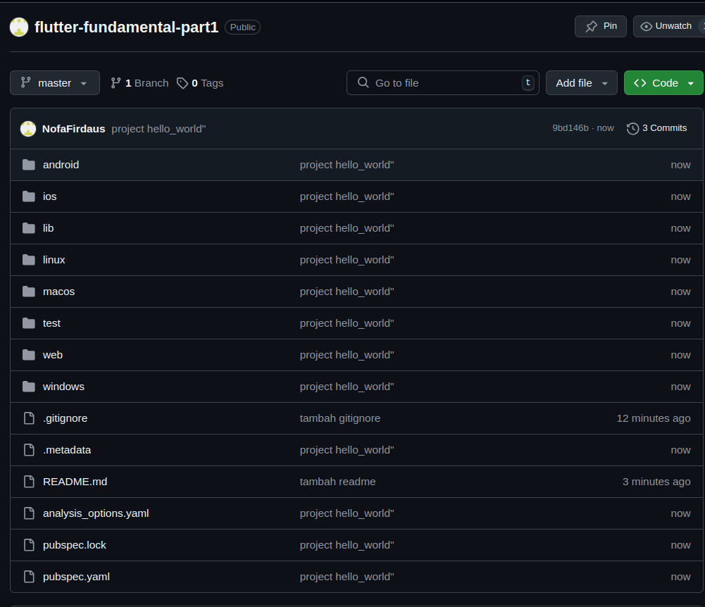

**Langkah 11** 
Kembali ke VS Code, ubah platform di pojok kanan bawah ke emulator atau device atau bisa juga menggunakan browser Chrome. Lalu coba running project  dengan tekan F5 atau Run > Start Debugging. Tunggu proses kompilasi hingga selesai, maka aplikasi flutter  akan tampil seperti berikut.

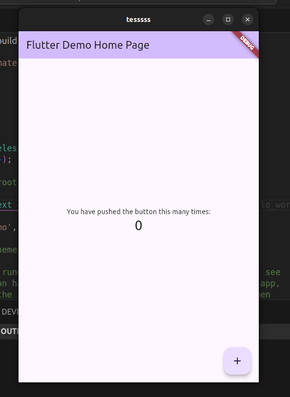


- **Pratikum 3 :** Menerapkan Widget Dasar

**Langkah 1** : Teks Widget
Buat folder baru di dalam folder lib.Kemudian buat file teks_widget.dart.

code : 
[teks_widget.dart](lib/components/teks.dart)

```dart
import 'package:flutter/material.dart';

class TeksWidget extends StatelessWidget {
  const TeksWidget({Key? key}) : super(key: key);

  @override
  Widget build(BuildContext context) {
    return const Text('Belajar Flutter || Kelas 2B',
    style: TextStyle(
      fontSize: 40,
      fontWeight: FontWeight.bold,
      color: Colors.amber
    ),);
  }
}
```
Lalu lakukan import file ke file main.dart
hasil : 

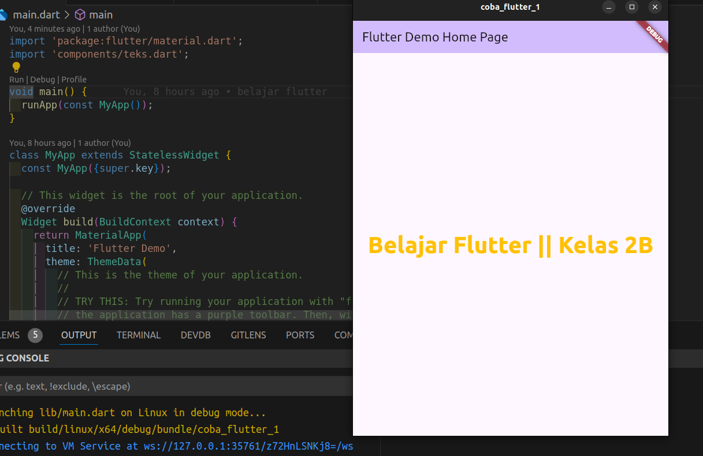

Langkah 2 : Image Widget
Buat  file image.dart di dalam folder components.


code  : 
[image.dart](lib/components/image.dart)

```dart
import 'package:flutter/material.dart';

class ImageWidget extends StatelessWidget {
  const ImageWidget({Key? key}) : super(key: key);

  @override
  Widget build(BuildContext context) {
    return const Image(
      image: AssetImage('assets/mountain-peak-through-trees.jpg'),
    );
  }
}
```


Lakukan penyesuaian asset pada file pubspec.yaml dan tambahkan file logo Anda di folder assets project.

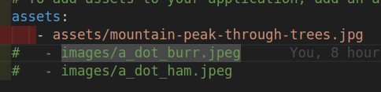

Hasil : 

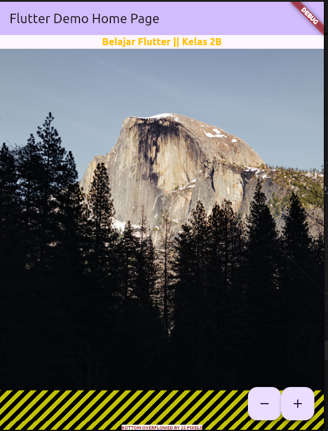

- **Pratikum 4 :** Menerapkan Widget Material Design dan iOS Cupertino.

**Langkah 1**: Cupertino Button dan Loading Bar
Buat file Loading_cupertino.dart.

code : 
[loading_cupertino.dart](lib/components/loading_cupertino.dart)


```dart
import 'package:flutter/cupertino.dart';
import 'package:flutter/material.dart';
class LoadingWidget extends StatelessWidget {
  const LoadingWidget({super.key});

  @override
  Widget build(BuildContext context) {
return MaterialApp(
   debugShowCheckedModeBanner: false,   
      home: Container(
        margin: const EdgeInsets.only(top: 30),
        color: Colors.black,
        child: Column(
          children: <Widget>[
            CupertinoButton(
              child: const Text("Hello World",style: TextStyle(color: Colors.white),),
              onPressed: () {},
            ),
            const CupertinoActivityIndicator(color: Colors.white,),
          ],
        ),
      ),
    );  }
}
```

Hasil :

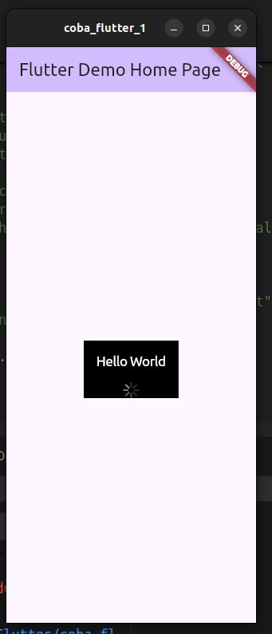

**Langkah 2**: Floating Action Button (FAB)

Buat file fab.dart.

code :

[fab.dart](lib/components/fab.dart)

```dart
import 'package:flutter/material.dart';

class FabWidget extends StatelessWidget {
  const FabWidget({super.key});

  @override
  Widget build(BuildContext context) {
    return MaterialApp(
      home: Scaffold(
        floatingActionButton: FloatingActionButton(
          onPressed: () {
            // Add your onPressed code here!
          },
          backgroundColor: Colors.pink,
          child: const Icon(Icons.thumb_up),
        ),
      ),
    );
  }
}
```

hasil : 

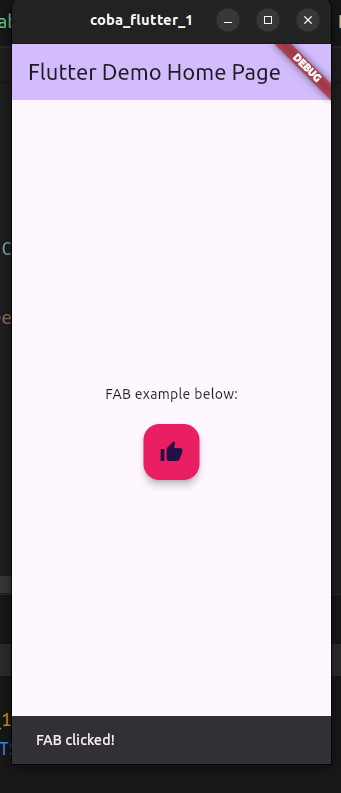


**Langkah 3**
Scaffold widget digunakan untuk mengatur tata letak sesuai dengan material design.

code : 
[scafold.dart](lib/components/scafold.dart)

```dart
class MyApp extends StatelessWidget {
  const MyApp({super.key});

  // This widget is the root of your application.
  @override
  Widget build(BuildContext context) {
    return MaterialApp(
      title: 'Flutter Demo',
      theme: ThemeData(
        primarySwatch: Colors.red,
      ),
      home: const MyHomePage(title: 'My Increment App'),
    );
  }
}

class MyHomePage extends StatefulWidget {
  const MyHomePage({Key? key, required this.title}) : super(key: key);

  final String title;

  @override
  State<MyHomePage> createState() => _MyHomePageState();
}

class _MyHomePageState extends State<MyHomePage> {
  int _counter = 0;

  void _incrementCounter() {
    setState(() {
      _counter++;
    });
  }

  @override
  Widget build(BuildContext context) {
    return Scaffold(
      appBar: AppBar(
        title: Text(widget.title),
      ),
      body: Center(
        child: Column(
          mainAxisAlignment: MainAxisAlignment.center,
          children: <Widget>[
            const Text(
              'You have pushed the button this many times:',
            ),
            Text(
              '$_counter',
              style: Theme.of(context).textTheme.headlineMedium,
            ),
          ],
        ),
      ),
      bottomNavigationBar: BottomAppBar(
        child: Container(
          height: 50.0,
        ),
      ),
      floatingActionButton: FloatingActionButton(
        onPressed: _incrementCounter,
        tooltip: 'Increment Counter',
        child: const Icon(Icons.add),
      ), 
      floatingActionButtonLocation: FloatingActionButtonLocation.centerDocked,
    );
  }
}
```

hasil : 

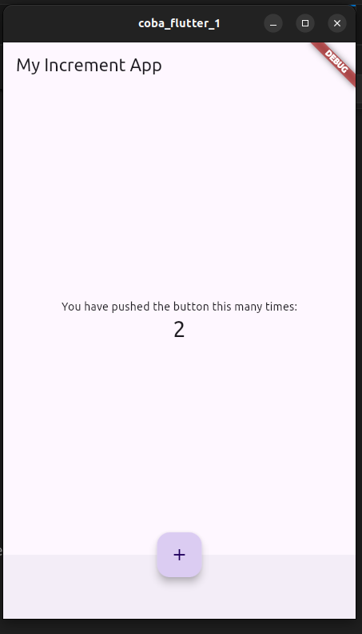


- **Langkah 4:** Dialog Widget

Dialog widget pada flutter memiliki dua jenis dialog yaitu AlertDialog dan SimpleDialog.

code : 
[dialog_widget.dart](lib/components/dialog_widget.dart)

```dart
import 'package:flutter/material.dart';

class MyApp extends StatelessWidget {
  const MyApp({Key? key}) : super(key: key);

  @override
  Widget build(BuildContext context) {
    return const MaterialApp(
      home: Scaffold(
        body: MyLayout(),
      ),
    );
  }
}

class MyLayout extends StatelessWidget {
  const MyLayout({Key? key}) : super(key: key);

  @override
  Widget build(BuildContext context) {
    return Padding(
      padding: const EdgeInsets.all(8.0),
      child: ElevatedButton(
        child: const Text('Show alert'),
        onPressed: () {
          showAlertDialog(context);
        },
      ),
    );
  }
}

showAlertDialog(BuildContext context) {
  // set up the button
  Widget okButton = TextButton(
    child: const Text("OK"),
    onPressed: () {
      Navigator.pop(context);
    },
  );

  // set up the AlertDialog
  AlertDialog alert = AlertDialog(
    title: const Text("My title"),
    content: const Text("This is my message."),
    actions: [
      okButton,
    ],
  );

  // show the dialog
  showDialog(
    context: context,
    builder: (BuildContext context) {
      return alert;
    },
  );
}
```

hasil :

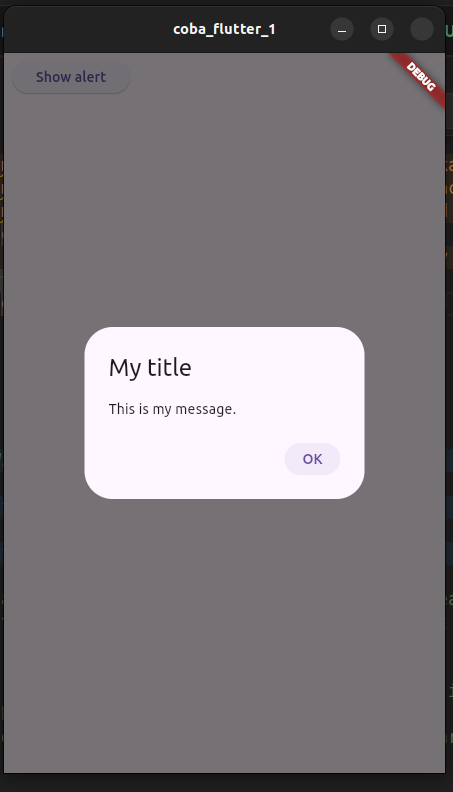

- **Langkah 5:** Input dan Selection Widget

Flutter menyediakan widget yang dapat menerima input dari pengguna aplikasi yaitu antara lain Checkbox, Date and Time Pickers, Radio Button, Slider, Switch, TextField.

code : 
[dialog_widget.dart](lib/components/input&selection.dart)

```dart
import 'package:flutter/material.dart';

class MyApp extends StatelessWidget {
  const MyApp({Key? key}) : super(key: key);

  @override
  Widget build(BuildContext context) {
    return MaterialApp(
      home: Scaffold(
        appBar: AppBar(title: const Text("Contoh TextField")),
        body: const Center(
          child: TextField(
          obscureText: false,
          decoration: InputDecoration(
            border: OutlineInputBorder(),
            labelText: 'Nama',
          ),
        ),
        ) 
      ),
    );
  }
}
```
hasil : 

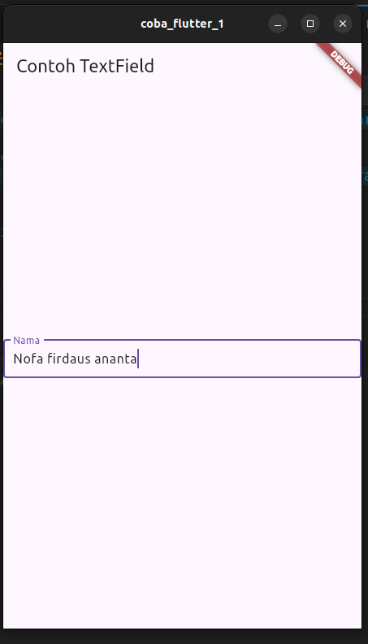


- **Langkah 6:** Date and Time Pickers
Date and Time Pickers termasuk pada kategori input dan selection widget.


code : 
[date&time_picker.dart](lib/components/date&time_picker.dart)


```dart
import 'dart:async';
import 'package:flutter/material.dart';
class MyApp extends StatelessWidget {
  const MyApp({Key? key}) : super(key: key);

  @override
  Widget build(BuildContext context) {
    return const MaterialApp(
      title: 'Contoh Date Picker',
      home: MyHomePage(title: 'Contoh Date Picker'),
    );
  }
}

class MyHomePage extends StatefulWidget {
  const MyHomePage({Key? key, required this.title}) : super(key: key);

  final String title;

  @override
  _MyHomePageState createState() => _MyHomePageState();
}

class _MyHomePageState extends State<MyHomePage> {
  // Variable/State untuk mengambil tanggal
  DateTime selectedDate = DateTime.now();

  //  Initial SelectDate FLutter
  Future<void> _selectDate(BuildContext context) async {
    // Initial DateTime FIinal Picked
    final DateTime? picked = await showDatePicker(
        context: context,
        initialDate: selectedDate,
        firstDate: DateTime(2015, 8),
        lastDate: DateTime(2101));
    if (picked != null && picked != selectedDate) {
      setState(() {
        selectedDate = picked;
      });
    }
  }

  @override
  Widget build(BuildContext context) {
    return Scaffold(
      appBar: AppBar(
        title: Text(widget.title),
      ),
      body: Center(
        child: Column(
          mainAxisSize: MainAxisSize.min,
          children: <Widget>[
            Text("${selectedDate.toLocal()}".split(' ')[0]),
            const SizedBox(
              height: 20.0,
            ),
            ElevatedButton(
              onPressed: () => {
                _selectDate(context),
                // ignore: avoid_print
                print(selectedDate.day + selectedDate.month + selectedDate.year)
              },
              child: const Text('Pilih Tanggal'),
            ),
          ],
        ),
      ),
    );
  }
}
```

hasil : 
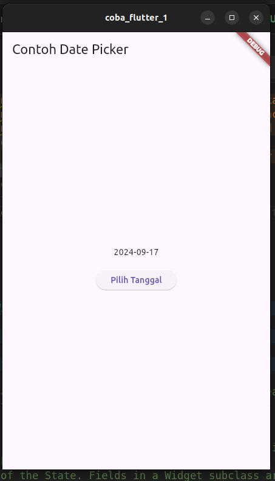